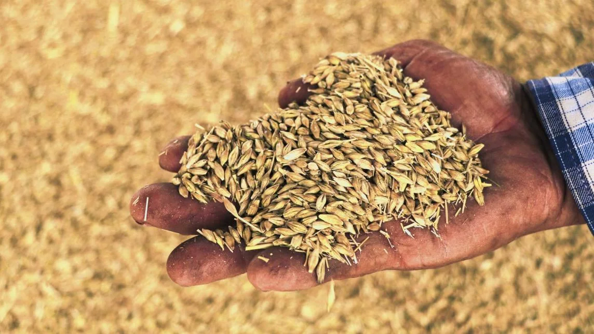

# 2.1 Importancia estratégica y económica

* **Motor de Desarrollo Rural:** La cebada representa una actividad económica vital para las zonas rurales en México. Su cultivo es una fuente de ingresos directa para miles de productores en estados como Hidalgo, Guanajuato, Tlaxcala y Puebla, permitiendo la diversificación de actividades en el campo frente a la inestabilidad de otros cultivos.

<figure><figcaption>
<em>Producción nacional de cebada por estado. Fuente: La Buena Cheve, 2021.</em>
</figcaption></figure>

* **Contribución al Producto Interno Bruto (PIB)**: El sector primario aporta aproximadamente el _3% del PIB nacional._ Dentro de este sector, la cebada es un eslabón estratégico que garantiza que las actividades agropecuarias mantengan su relevancia en la economía mexicana.
* **Eslabón Estratégico en la Cadena de Valor:** Existe una interdependencia crítica entre el productor agrícola, los centros de acopio y la industria procesadora. En particular, México se posiciona como el principal proveedor de cerveza a nivel internacional, exportando el 21.32% del valor total de las exportaciones mundiales ; la cebada es el insumo básico (malta) que hace posible esta industria masiva.
* **Vulnerabilidad y Seguridad Alimentaria:** La falta de información de mercado y la presencia excesiva de intermediarios aumentan la incertidumbre económica para los productores. Cuando la producción nacional es insuficiente, el país debe recurrir a importaciones, lo que expone a México a la volatilidad de los precios internacionales y afecta la rentabilidad del productor local.
