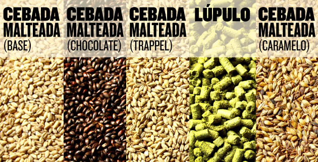

# 2.2 Tipos y Clasificación del grano

La cebada no es un producto uniforme; su valor comercial y su aplicación industrial están determinados por características físicas y bioquímicas específicas que se definen desde su cosecha. Para efectos de análisis y predicción de precios, es indispensable segmentar el mercado de la siguiente manera:

* **Cebada Cervecera**: Es el segmento de mayor exigencia técnica. Para ser clasificada como tal, el grano debe cumplir con estándares estrictos, tales como:
  * Calibre: Uniformidad en el tamaño del grano para asegurar una absorción de agua homogénea durante el proceso de malteado.
  * Proteína: Niveles controlados de proteína (generalmente bajos) para garantizar la claridad y estabilidad de la cerveza.
  * Poder Germinativo: Una alta tasa de germinación es crítica, ya que la malta se obtiene a partir de un grano vivo capaz de activar sus enzimas.
  * _Nota técnica:_ Cualquier desviación en estos parámetros (debido a estrés hídrico, plagas o manejo inadecuado) provoca que el grano sea degradado a la categoría de forrajera, lo que conlleva una pérdida económica inmediata para el productor.
*   **Cebada Forrajera**: Está orientada principalmente al sector pecuario para la alimentación animal.

    * Enfoque nutricional: A diferencia de la cervecera, aquí el énfasis recae en el rendimiento energético y proteico total por hectárea.
    * Dinámica de mercado: Su precio es más estable y está altamente correlacionado con los mercados internacionales de granos básicos, como el maíz y el trigo. Es, en esencia, un _commodity_ que responde a la oferta y demanda global de alimento para ganado

    Es fundamental precisar la distinción entre la clasificación del grano y los productos derivados del proceso industrial:

    * **Clasificación del Grano (Materia Prima):** Se basa en parámetros de calidad del campo (calibre, proteína, germinación) que definen su destino comercial:
      * **Cebada Cervecera**: Exige estándares rigurosos de uniformidad y calidad enzimática para su procesamiento.
      * **Cebada Forrajera**: Enfocada en el rendimiento nutricional para la industria pecuaria.
    * **Tipos de Malta** (Producto Industrial): La malta es el resultado de la germinación controlada y el secado de la cebada. Las variedades (ej. Pilsner, Múnich, Chocolate, Ahumada) no son tipos de cebada _per se_, sino estilos de malta derivados de las temperaturas de horneado aplicadas durante el proceso de malteado.

<figure><figcaption>
<em>Proceso de transformación del grano: del macerado y cocción a la fermentación final. Fuente: Verema, "Cómo elaborar cerveza casera" (2012).</em>
</figcaption></figure>

