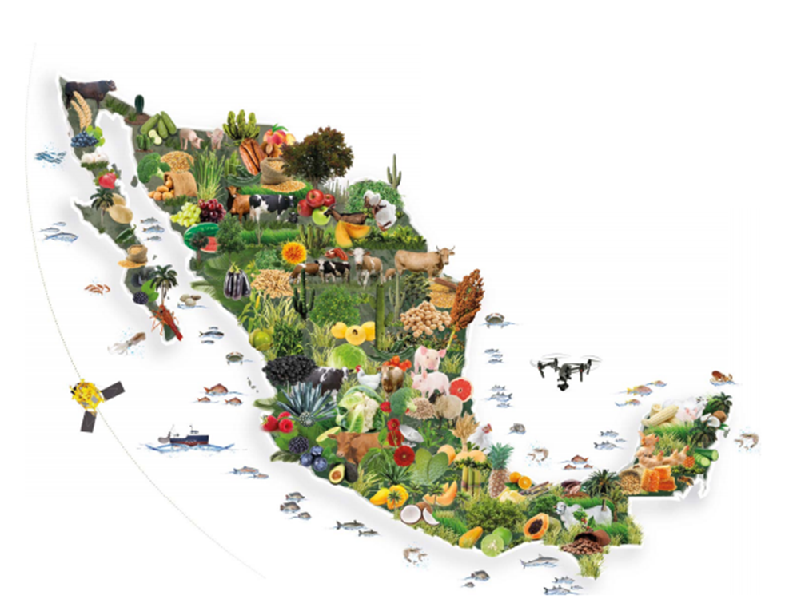

# Refelxion final

Como equipo de científicos de datos, este proyecto nos ha reafirmado una verdad fundamental: el campo no necesita solo maquinaria agrícola, necesita arquitectura de datos.

El sector agroalimentario en México aporta el 1.5% del PIB nacional (INEGI, 2026), pero a menudo opera con una asimetría de información que castiga injustamente al productor. Nuestra labor ha sido cerrar esa brecha. No nos limitamos a escribir algoritmos; construimos herramientas que devuelven el poder de decisión al agricultor. Al convertir el dato en una ventaja competitiva, estamos transformando el "descarte" en insumos especializados y el "costo logístico" en una red eficiente.

Estamos convencidos de que el futuro de la agricultura mexicana depende de la tecnificación de la toma de decisiones. Como equipo, nos sentimos orgullosos de haber creado una plataforma que no solo analiza el pasado, sino que proyecta y optimiza el futuro. Este proyecto es solo el comienzo; nuestra meta sigue siendo profesionalizar cada eslabón de la cadena, asegurando que la tecnología sea el catalizador para que el campo prospere de manera inteligente, sostenible y rentable.

<figure><figcaption>
FUENTE: Agroproductores
</figcaption></figure>

**¿Listos para colaborar o integrar estas soluciones?**

Estamos abiertos a intercambiar ideas, recibir opiniones o discutir cómo aplicar estos modelos a otros cultivos. Contáctenos para explorar y resolver tus dudas:

&#x20;Correo electrónico: [cebadaagro@gmail.com](https://www.google.com/search?q=mailto%3Acebadaagro%40gmail.com\&authuser=1)
