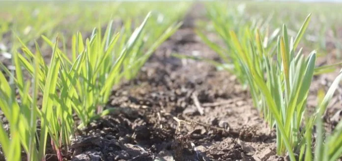

# Modelado Predictivo y Análisis de Escenarios

La agricultura es, por naturaleza, una actividad sujeta a la incertidumbre. Factores como la estacionalidad, los cambios climáticos regionales y la calidad biológica del grano hacen que la toma de decisiones no pueda basarse en intuiciones, sino en modelos analíticos.

Tras haber consolidado nuestra base de datos, el siguiente paso es pasar del análisis estático a un modelado dinámico. En esta sección, implementamos algoritmos que nos permiten evaluar variables probabilísticas para predecir el comportamiento de los ciclos de cultivo y optimizar la rentabilidad del productor.

Nuestro modelo analiza el comportamiento histórico de la cebada a nivel estatal y mensual. El objetivo es identificar cuándo el grano alcanza su punto óptimo de cosecha, equilibrando la producción con la demanda del mercado por medio de diversos algoritmos los cuales se presentan a continuación:

<figure><figcaption>
Fuente:Sitio web "Campototal.web.com.ar" 
</figcaption></figure>

